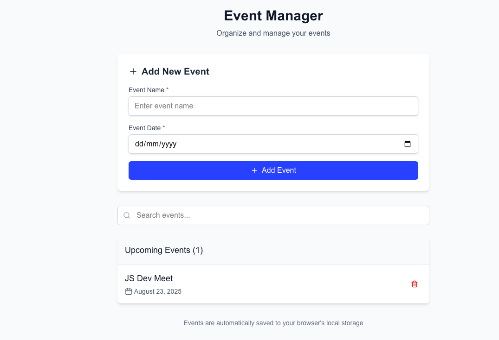

# Event Manager (Next.js + pnpm)
A simple Event Manager app built with **Next.js**, **TypeScript**, **Tailwind CSS**, and **pnpm**.  
Users can add, search, and delete events. All events are automatically saved to **localStorage**.

---

## 🚀 How to Run

1. **Install dependencies:**
   ```bash
   pnpm install
   ```

2. **Start the development server:**
   ```bash
   cd apps/web
   pnpm dev
   ```

3. **Open your browser at:**
   ```
   http://localhost:3000
   ```

---

## 📍 Page Path
- **Route**: `/events`
- **Full URL**: `http://localhost:3000`
- **File Location**: `apps/page.tsx`

---

## 📝 Notes / Assumptions
- Events are saved locally in the browser using **localStorage**
- No backend/database is used - purely client-side
- Event names and dates are **required fields** with validation
- Events list is automatically **sorted by date**
- Search works in a **case-insensitive** manner
- UI is styled using **Tailwind CSS** with responsive design
- Icons are provided by **lucide-react**
- Built on **Next-Forge Turbo** monorepo template
- Environment variables are required due to the template structure

---

## 🛠 Tech Stack
- **Framework**: Next.js 15 (App Router)
- **Template**: Next-Forge Turbo (Turborepo)
- **Language**: TypeScript
- **Styling**: Tailwind CSS
- **State**: React useState
- **Persistence**: localStorage
- **Package Manager**: pnpm

---

## ✅ Features
- ✅ Add events with name and date
- ✅ Delete individual events
- ✅ Real-time search/filter by name
- ✅ Automatic localStorage persistence
- ✅ Form validation with error messages
- ✅ Responsive mobile-friendly design
- ✅ Events sorted chronologically
- ✅ Empty state handling

---

## 📸 Preview
*Event Manager Interface showing the add form, search, and event list*



---

This is a minimal demo app built for learning purposes. You can extend it with features like:
- 🔐 Authentication
- 🗄️ Database persistence  
- 📅 Calendar view
- 🏷️ Event categories
- ⏰ Time selection
- 📤 Export/Import functionality
